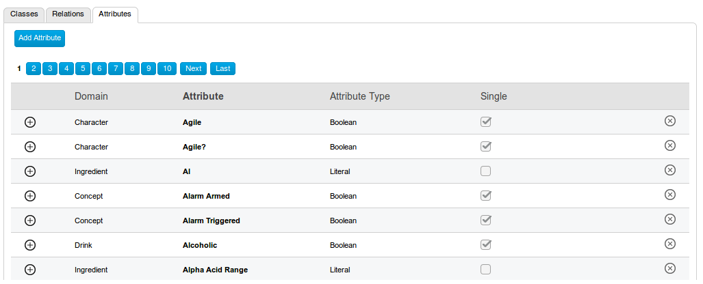

# PoolPartyAttributes

When you have many attributes in PoolParty, it's easy to accidentally duplicate them because there's no attribute search interface, just a browsing interface:



However, attributes can be exported to an RDF-JSON format (.rf). This script extracts all attribute names from this .rf file.

## Usage

1. Export your PoolParty ontology to RDF-JSON format (.rf)
2. Download ppatts.py to the same folder
3. Open your terminal in the same folder, and enter the command:

```Bash
$ python3 ppatt.py your_filename.rf
```

If you run into problems, make sure that you have **Python 3** with its **json** and **sys** libraries installed
