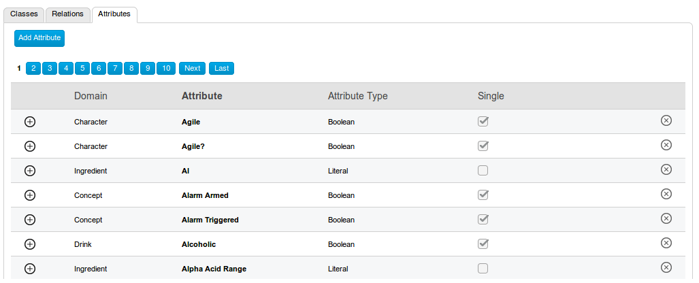
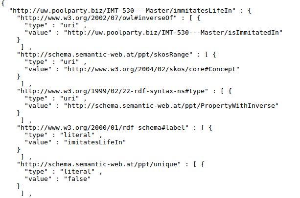

# PoolPartyAttributes

<br>

**When you have many attributes in PoolParty, it's easy to accidentally duplicate them because there's no attribute search interface, just a browsing interface:**



<br>

**However, attributes can be exported to RDF-JSON format (.rf):**



<br>

**This script extracts all attribute names from this .rf file and outputs a sorted list to a plain text file.**

<br>
<br>

## Usage

To run this script, you need ***Python 3*** with its ***json*** and ***sys*** libraries installed.

1. Export your PoolParty ontology to RDF-JSON format (.rf)
2. Download `ppatts.py` to the same folder
3. Open your terminal in the same folder, and enter the command:

```Bash
$ python3 ppatt.py your_filename.rf
```

4. Open the output file and check the beginning of the document for the total number of extracted terms; check this total against your PoolParty ontology
